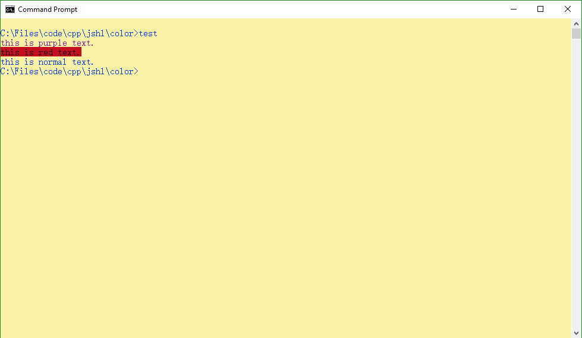

# windows控制台颜色

**这是一个基于windows api的设置控制台颜色的c++工具**

### 使用示例
```c++
#include "color.h"

int main(){
    std::cout << color::foreground_purple;
    std::cout << "this is purple text.\n";
    std::cout << (color::background_red | color::foreground_black);
    std::cout << "this is red text.\n";
    std::cout << color::resetcolor;
    std::cout << "this is normal text.";
    return 0;
}
```
上述代码如果在一个预先设置前景色为浅黄，背景色为蓝色的控制台(命令：`color e1`)下运行，得到如下结果：


### 常数
```c++
// 表示颜色的结构体
struct Color;

// 颜色常数
// 黑色特别定义，使用是一样的
static const Color foreground_black;        // 前景黑
static const Color background_black;        // 背景黑
static const Color all_black;               // 全黑

// 前景色
static const Color foreground_red;          // 红色
static const Color foreground_greed;        // 绿色
static const Color foreground_blue;         // 蓝色
static const Color foreground_aqua;         // 浅绿色= 绿色+蓝色
static const Color foreground_purple;       // 紫色  = 红色+蓝色
static const Color foreground_yellow;       // 黄色  = 红色+绿色
static const Color foreground_wight;        // 白色
static const Color foreground_gray;         // 灰色
static const Color foreground_light_red;    // 加 light 的都是原来颜色的淡色
static const Color foreground_light_green;
static const Color foreground_light_blue;
static const Color foreground_light_aqua;
static const Color foreground_light_purple;
static const Color foreground_light_yellow;
static const Color foreground_bright_wight; // 亮白 

// 背景色
static const Color background_red;          // 和前景色一样
static const Color background_greed;
static const Color background_blue;
static const Color background_aqua;
static const Color background_purple;
static const Color background_yellow;
static const Color background_wight;
static const Color background_gray;
static const Color background_light_red;
static const Color background_light_green;
static const Color background_light_blue;
static const Color background_light_aqua;
static const Color background_light_purple;
static const Color background_light_yellow;
static const Color background_bright_wight;
// 回复默认设置
static const Color resetcolor;              // 控制回复默认颜色的操作符
```

### 函数
```c++
std::ostream &operator<<(std::ostream &os, const Color &color); // 定义输出流对颜色结构的运算符
Color operator|(const Color &ca, const Color &cb);              // 定义两个颜色的混合
Color operator&(const Color &ca, const Color &cb);              // 实际这两个函数实现的是同样的功能
```
##### 两点说明：
1. 颜色混合即RGB颜色混合，比如"黄=红+绿"。而灰色和红色混合得到淡红色。需要注意的是三个淡色混合结果是亮白，或者白色加灰色混合也是亮白。亮白是windows api特别定义的。
2. 颜色的混合定义两个功能一样的函数，是因为，"位或"是windows api实现颜色混合的方式，而"与"在语义上似乎更接近颜色混合。而windows api使用"位与"实现的功能看上去并没有实际用途。