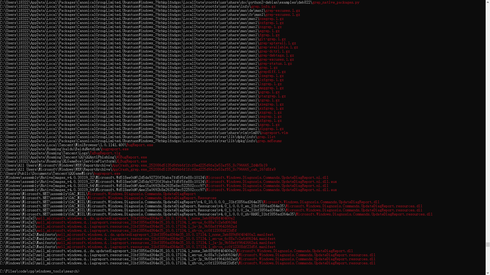
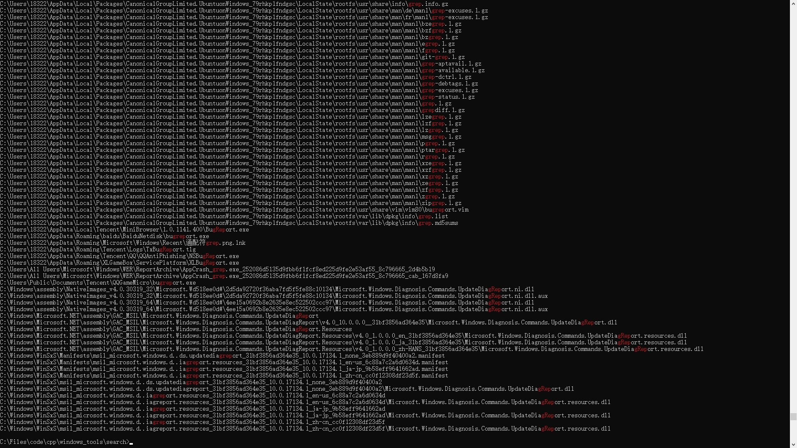

# 控制台文件搜索工具

### 使用方法
```text
usage: search [options] pattern [directory]
    search files in command line (only for windows)

arguements:
  pattern               pattern for search
  directory             set search directory if given

options:
  -h, --help            show this help message and exit
  -r                    if this arguement exists, use regex to search
```
- `-r`存在则使用正则表达式搜索，否则使用windows通配符搜索
- 由于windows下文件名不区别大小写，所以正则搜索也不匹配大小写

### 示例
下面是利用此工具进行全C盘搜索的结果：
- 通配符
```batch
search *grep* C:\
```

- 正则
```batch
search -r grep C:\
```
